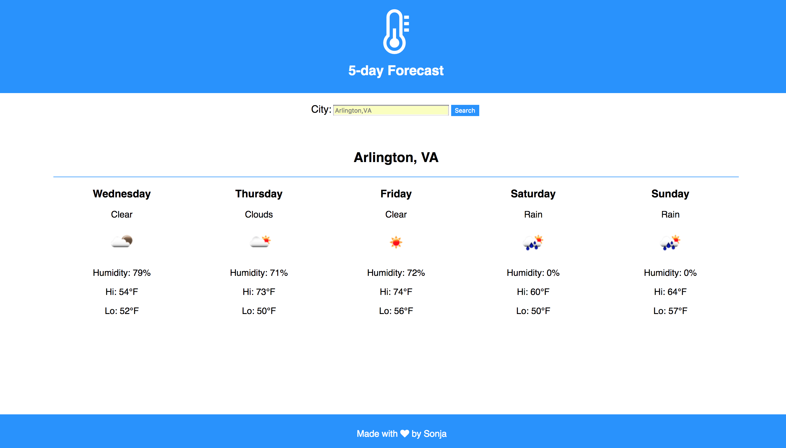

# 5-Day Forecast

This is a one-page, responsive application to get the forecast for the next five days in a city by searching. This application expects to receive the search terms as {city name},{2 character state code} for any city in the US. The weather data is ingested from the OpenWeatherMap API. 

This project was bootstrapped with [Create React App](https://github.com/facebookincubator/create-react-app).

## Screenshot



## Launching the app

Download the repository, run ```npm install```.

```
npm start
```
This will launch the app at http://localhost:3000/ 

## Built With

* React
* Redux

## Author

* **Sonja Duric**


